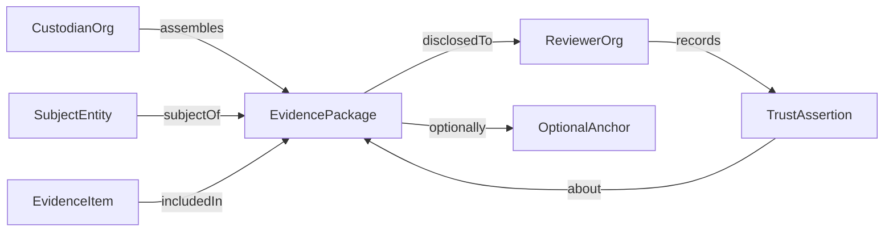

# Domain Model

**Document ID:** DOC-DOMAIN  
**Status:** Draft  
**Last updated:** 2026-06-28

Conceptual domain model for TrustRegistry. This document defines **concepts and relationships**—not database schemas, APIs, or implementation details.

Split into EntityModel, EvidenceModel, TrustModel, and ApprovalModel when this document stabilises. **Entity detail:** [EntityModel.md](EntityModel.md) (EM-010+).

**Scope boundary:** PostgreSQL row-level change history is **AuditorsVault** domain (ADR-020), not modeled here.

---

## Overview

TrustRegistry models the flow from evidence custodianship through packaged disclosure to independent reviewer assertions—with optional external anchoring.

---

## Core concepts

### DM-010 — Subject Entity (instance)

The **Entity** is a **subject of assurance**—a specific individual, organisation, property, asset, or other typed subject that an evidence package addresses.

This concept is expanded in [EntityModel.md](EntityModel.md). At summary level:

- An **Entity Instance** is classified by exactly one **Entity Type** (ADR-040).
- Types define attribute schemas and optional evidence requirement profiles; instances hold typed attribute values.
- **v1 beachhead:** person and organisation instances (onboarding / approval).
- **Platform lifetime:** property, condominium, diamond, artwork, and extensible future types—without changing ADR-010 package semantics.

**Working definition (Q-020 — refined by ADR-040):** Entity instance = typed subject referenced by an evidence package, owned by a custodian tenant.

**Rules:**

- Every evidence package has exactly one primary entity instance subject.
- Entity instance is not synonymous with custodian—a custodian may hold instances and packages about third parties.
- One custodian may enable and manage **many entity types** (EM-040).

---

### DM-020 — Custodian Organisation

The tenant organisation that owns, assembles, and controls disclosure of evidence packages.

**Relationships:**

- Assembles one or more Evidence Packages
- Authorises Disclosures
- May employ Users with custodian roles

**Rules:**

- Custodian data is tenant-isolated (FP-070).
- Custodian does not "speak for" reviewers or the platform.

---

### DM-030 — Evidence Item

A single unit of evidence—document, log, attestation, or structured record.

**Attributes (conceptual):** Content or secure reference, content hash, metadata (title, type, date, source), ingestion timestamp.

**Relationships:**

- Included in one or more Evidence Package versions (typically one active package version at a time)
- Contributes to package Integrity Proof

**Rules:**

- Evidence items are immutable once incorporated into a published package version (FP-060).
- Supersession uses new items or new package versions—not silent overwrite.

---

### DM-040 — Evidence Package

The **central boundary object** of the domain (ADR-010).

A bounded, versioned collection of evidence items, metadata, integrity proof, and optional anchor—assembled for a defined assurance purpose regarding a Subject Entity.

**Attributes (conceptual):**

- Purpose / scope description
- Version identifier
- Status (draft, published, superseded, archived)
- Integrity proof (manifest hash, Merkle root, etc.)
- Optional anchor reference

**Relationships:**

- Has one Subject Entity
- Assembled by one Custodian Organisation
- Contains many Evidence Items
- Disclosed to Reviewers via Disclosure records
- Subject of Trust Assertions
- Optionally linked to Anchor

**Rules:**

- Published packages are immutable; changes create new versions (FP-060).
- Disclosure grants scoped access to a specific package version (FP-030).
- Export produces a portable representation including integrity proofs (FP-080).

---

### DM-050 — Disclosure

An explicit grant of access from Custodian to Reviewer for a specific Evidence Package (version).

**Attributes (conceptual):** Authorised by, timestamp, scope (full package or defined subset), expiry, revocation status.

**Rules:**

- Every reviewer access to custodian evidence is mediated by a Disclosure (FP-030).
- Disclosure events are auditable.

---

### DM-060 — Reviewer Organisation

An organisation authorised to view a disclosed package and record Trust Assertions.

**Relationships:**

- Receives Disclosures
- Records Trust Assertions on packages

**Rules:**

- Reviewers may be platform tenants or external parties (Q-030).
- Reviewers are independent; platform does not rank their assertions (FP-010, FP-050).

---

### DM-070 — Trust Assertion

An attributed statement by a Reviewer about an Evidence Package.

**Attributes (conceptual):** Reviewer organisation, optional individual author, assertion type (Q-060), statement content, timestamp, scope (whole package or aspect).

**Relationships:**

- About one Evidence Package (version)
- Recorded by one Reviewer Organisation

**Rules:**

- Multiple assertions on the same package may coexist and conflict (FP-010).
- Assertions are never platform-authored (FP-050).
- Assertions are append-only; retraction is additive (FP-060).

---

### DM-080 — Integrity Proof

Cryptographic structure proving package contents and metadata are intact.

**Relationships:**

- Computed from Evidence Package contents
- May be referenced by Anchor

**Rules:**

- Verifiable offline from exported package (FP-020, FP-080).
- Does not require blockchain.

---

### DM-090 — Anchor (optional)

External commitment of an integrity proof via a Publishing Provider.

**Relationships:**

- References one Evidence Package version's integrity proof
- Published through one Publishing Provider

**Rules:**

- Optional (FP-020).
- Failure or absence of anchor does not invalidate package integrity proof.

---

### DM-100 — Publishing Provider

Pluggable mechanism for external anchoring—not part of core domain identity.

**Implementations (examples):** None, public chain, private notary, timestamp authority.

---

## Key workflows (conceptual)

### Assemble and publish

1. Custodian creates draft Evidence Package for Subject Entity
2. Custodian adds Evidence Items
3. Custodian publishes version → Integrity Proof computed
4. Optional: Anchor via Publishing Provider

### Disclose and review

1. Custodian creates Disclosure to Reviewer for package version
2. Reviewer accesses package (in-platform or via export—Q-030)
3. Reviewer verifies integrity proof
4. Reviewer records Trust Assertion

### Disagreement

1. Reviewer A asserts satisfactory; Reviewer B asserts qualified concern
2. Platform displays both assertions with attribution
3. Platform does not resolve dispute (FP-010)

### Correct and supersede

1. Custodian identifies error in published package
2. Custodian publishes new package version; prior version marked superseded
3. History preserved; no silent edit (FP-060)

---

## Boundaries and deferrals

| Concept | v1 | Defer |
|---------|----|----|
| Subject Entity | person, organisation (v1) | Other types via metamodel; relationships Q-101 |
| Trust Assertion types | Minimum structure (Q-060) | Full taxonomy |
| Approval workflows | Not modelled | ApprovalModel.md when needed |
| In-platform vs export review | Open (Q-030) | — |
| DB change history | AuditorsVault (ADR-020) | Not TrustRegistry domain |

---

## Principle traceability

| Concept | Principles |
|---------|------------|
| Evidence Package | ADR-010, FP-040, FP-080 |
| Disclosure | FP-030, FP-070 |
| Trust Assertion | FP-010, FP-050 |
| Integrity Proof / Anchor | FP-020 |
| Version history | FP-060 |

---

## Related documents

- [Terminology.md](../governance/Terminology.md)
- [EntityModel.md](EntityModel.md)
- [ArchitectureDecisionLog.md](../governance/ArchitectureDecisionLog.md) — ADR-010, ADR-020, ADR-040
- [Questions.md](../governance/Questions.md) — Q-020, Q-100–Q-103
