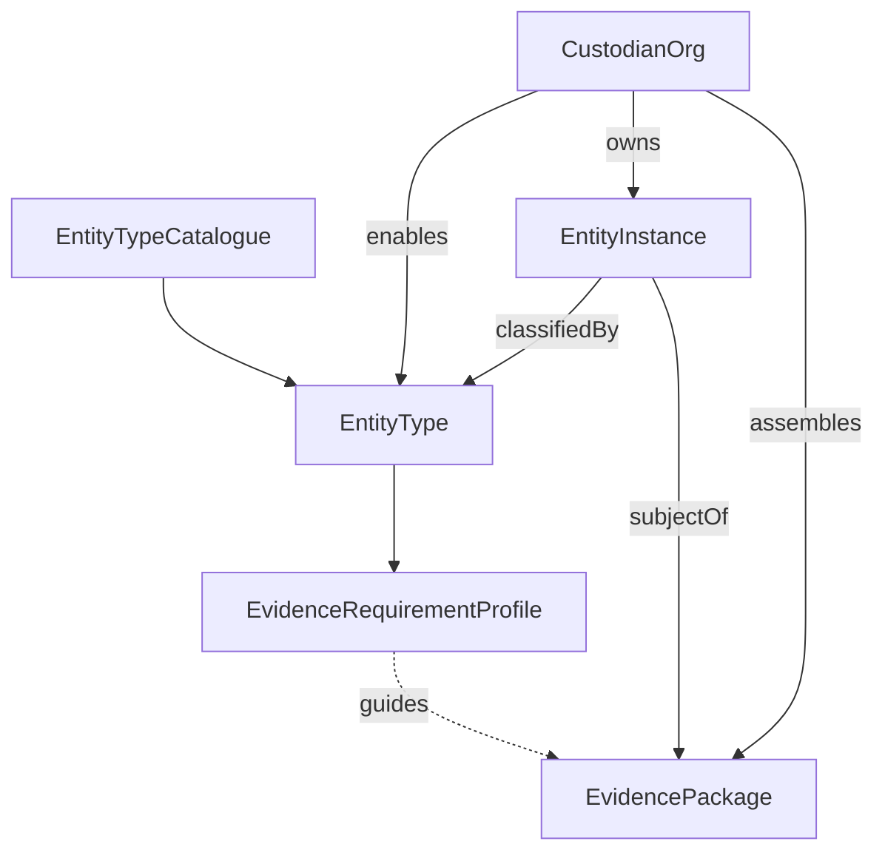

# Entity Model

**Document ID:** DOC-ENTITY  
**Status:** Draft  
**Last updated:** 2026-06-28

Conceptual model for **entities** and **entity types** in TrustRegistry. Split from [DomainModel.md](DomainModel.md) because entity extensibility is a primary architectural concern.

**Related:** [ADR-040](../governance/ArchitectureDecisionLog.md) — entity type metamodel.

---

## Design intent

TrustRegistry must support **many kinds of subject** over the product lifetime—individuals, companies, properties, condominiums, diamonds, artwork, and types not yet named—without redesigning the core domain for each one.

**v1 beachhead:** onboarding and approval of **individuals and companies** (see [ProductVision.md](../governance/ProductVision.md)).

**Platform commitment:** extensible **entity type metamodel** from day one; additional types are **configuration and templates**, not core code forks (FP-090 applies to workflows, not to the metamodel).

---

## Core concepts

### EM-010 — Entity Type

A **definition** of a class of subject that can be onboarded, evidenced, and asserted against.

**Examples (platform lifetime, not all v1):**

| Entity type | Example attributes (illustrative) |
|-------------|-----------------------------------|
| `person` | Legal name, date of birth, ID references |
| `organisation` | Legal name, registration number, jurisdiction |
| `property` | Address, title reference, jurisdiction |
| `condominium` | Name, managing body, unit registry reference |
| `diamond` | Certificate lab, carat, report number |
| `artwork` | Artist, provenance reference, catalogue raisonné ID |

**Attributes (conceptual):**

- Stable type identifier (slug/code)
- Display name and description
- **Attribute schema** — structure and validation rules for instance data (conceptually JSON Schema or equivalent; format TBD in Architecture)
- Version identifier (types evolve; see EM-050)
- Optional **evidence requirement profile** (EM-030)

**Rules:**

- Entity types are **data-defined**, not hard-coded per type in application logic.
- Domain operations (packages, disclosure, assertions) reference **entity instances**, not entity type-specific code paths.
- New types may be added without changing ADR-010 boundary objects.

---

### EM-020 — Entity Instance

A **specific subject** of assurance, classified by exactly one Entity Type at a point in time.

**Attributes (conceptual):**

- Identifier
- Entity type reference (and type version used at creation)
- Custodian organisation (owner of this instance within tenant)
- **Typed attributes** — values conforming to the type's attribute schema
- Lifecycle status (draft, active, archived, etc.—TBD)
- Optional external references (registry IDs, CRM keys)

**Rules:**

- Every evidence package has exactly one primary **entity instance** subject (inherits DM-040).
- An instance belongs to one custodian tenant (FP-070).
- Attribute changes after packages are published are **additive/versioned** where they affect assurance history (FP-060)—exact mechanics TBD.

---

### EM-030 — Evidence Requirement Profile

A **template** associating an entity type (and optionally an assurance purpose) with expected evidence categories or items—not pre-filled evidence, but **what a complete package should address**.

**Examples:**

- `person` + KYC onboarding → identity document, proof of address
- `property` + transfer diligence → title deed, survey, charges register
- `diamond` + provenance → lab certificate, chain-of-custody records

**Rules:**

- Profiles **guide** custodians; they do not auto-certify completeness (FP-010).
- Profiles may differ per entity type and per **assurance purpose** (onboarding, periodic review, transaction—TBD Q-102).
- v1 may ship with one profile per beachhead type; metamodel supports many.

---

### EM-040 — Tenant Entity Type Enablement

The relationship **one custodian → many entity types** enabled for that tenant.

**Attributes (conceptual):**

- Custodian organisation
- Entity type reference
- Enabled/disabled, effective dates
- Optional tenant-specific profile overrides (Q-100)

**Rules:**

- A tenant may onboard instances only for **enabled** entity types.
- Platform may offer a **catalogue** of standard types; tenants enable subsets relevant to their business.
- Tenant-specific type definitions (custom types) are a product decision (Q-100)—not assumed for v1.

---

### EM-050 — Entity Type Versioning

Entity type definitions **evolve** (new attributes, stricter validation). Instances record which type version they were created under; migrations are explicit—not silent (FP-060).

**Defer:** Detailed migration UX and API—record intent now.

---

### EM-060 — Entity Relationships (deferred detail)

Subjects are not always isolated—a **condominium** relates to **unit properties**; a **company** relates to **directors** (persons). Relationships may affect disclosure scope and package assembly.

**Status:** Recognised; detailed model deferred (Q-101).

**Working rule:** v1 packages have **one primary instance**; relationships are metadata or linked instances in later phases—not a graph database requirement on day one.

---

## Conceptual diagram

---

## v1 scope vs platform lifetime

| Capability | v1 beachhead | Platform metamodel |
|------------|--------------|-------------------|
| Entity types | `person`, `organisation` (hypothesis) | Any definable type |
| Attribute schema | Fixed schemas for v1 types | Schema-driven per type |
| Evidence profiles | Onboarding/KYC for v1 types | Per type + purpose |
| Tenant enablement | Implicit (tenant uses v1 types) | Explicit enablement (EM-040) |
| Relationships | Minimal or none | Condominium ↔ units, etc. |
| Custom tenant types | Defer (Q-100) | Supported if product allows |

---

## Anti-patterns to avoid

| Anti-pattern | Why it fails |
|--------------|--------------|
| Separate database table per entity type | Does not scale to artwork, diamonds, etc. |
| Entity type logic in client only | Breaks API-first (ADR-030) and integrity (NFR-040) |
| Building all types in v1 | Violates FP-090 |
| Unlimited tenant-defined types with no governance | Schema chaos, reviewer confusion (RISK-100) |
| Hard-coding "company OR person" in API routes | Blocks property and asset types without API break |

---

## Traceability

| Concept | ADR / FR / Q |
|---------|----------------|
| Entity Type / Instance | ADR-040, FR-010, FR-012 |
| Evidence profiles | FR-013, Q-102 |
| Tenant enablement | EM-040, Q-100 |
| Relationships | Q-101 |

---

## Related documents

- [DomainModel.md](DomainModel.md) — DM-010 (summary), packages, assertions
- [Terminology.md](../governance/Terminology.md)
- [Questions.md](../governance/Questions.md) — Q-020, Q-100–Q-103
