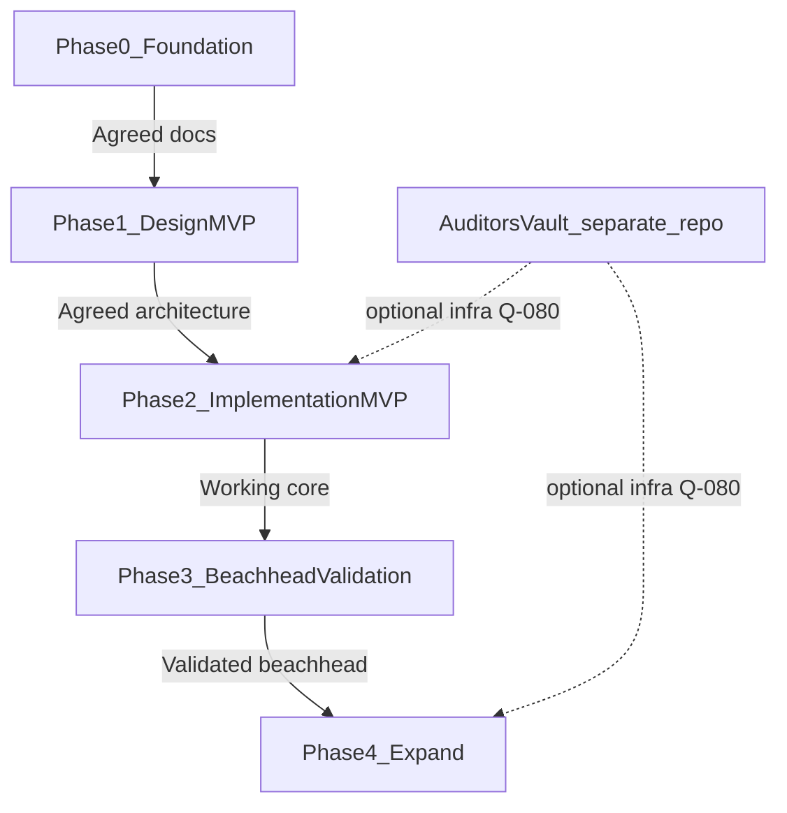

# Roadmap

**Document ID:** DOC-ROADMAP  
**Status:** Draft  
**Last updated:** 2026-06-28

Phased outcomes for TrustRegistry—not a feature laundry list or committed timeline. Dates are added only when explicitly committed.

---

## Phase 0 — Foundation (current)

**Outcome:** Documentation-first project established; constitutional documents drafted for review.

**Deliverables:**

- [x] Repository at `C:\GitHub\TrustRegistry`
- [x] Platform Principles (Draft)
- [x] Product Vision (Draft)
- [x] Terminology (Draft)
- [x] Questions and Risks registers
- [x] Problem Statement (Draft)
- [x] Domain Model (Draft)
- [x] ADR-010 Evidence package boundary
- [x] ADR-020 TrustRegistry / AuditorsVault separation
- [x] Requirements NFRs + core FRs (Draft)
- [ ] **Gate:** Waves 1–3 documents reach **Agreed**

**Exit criteria:** Stakeholder agreement on principles, vision, problem, domain model, and ADR-010/ADR-020. Q-010 beachhead validated or explicitly chosen.

---

## Phase 1 — Design MVP

**Outcome:** Agreed design sufficient to implement a minimal vertical slice—no production code until Phase 0 gate passed.

**Deliverables:**

- Architecture document (tenant model, package lifecycle, integrity proof approach)
- AuditorsVault integration boundary (resolve Q-080)
- Security document (isolation, auth, audit, disclosure authorisation)
- API outline (package, disclosure, assertion operations)
- User journeys for custodian publish/disclose and reviewer assert flows
- Wireframes for critical paths only
- Resolve Q-030 (review mechanism), Q-060 (assertion types), Q-040 (residency) as needed for design

**Exit criteria:** Architecture, Security, API, and core UI journeys **Agreed**.

**Non-goals:** Full GRC feature parity, all publishing providers, all verticals, AuditorsVault feature parity inside TrustRegistry.

---

## Phase 2 — Implementation MVP

**Outcome:** Working multi-tenant SaaS demonstrating core trust mechanics for beachhead use case.

**Minimum capabilities:**

1. Custodian: create entity, assemble package, publish with integrity proof
2. Custodian: disclose package to reviewer
3. Reviewer: access package, verify integrity, record assertion
4. Both: view attributed assertions without platform verdict
5. Custodian: export package with proofs

**Optional for MVP:** External anchoring (FR-100); AuditorsVault integration (FR-D050)—integrity proof alone satisfies FP-020.

**Exit criteria:** End-to-end demo with real beachhead scenario; NFR-010, NFR-040, NFR-060 demonstrated.

---

## Phase 3 — Beachhead validation

**Outcome:** Paying or pilot customers in chosen vertical validate inter-org trust value proposition.

**Focus:**

- Measure success signals from Product Vision
- Refine assertion types and reviewer UX based on real disputes and workflows
- Split Domain Model into EntityModel, EvidenceModel, TrustModel if warranted

**Exit criteria:** Evidence that customers pay for portable packages + independent review—not checklist features alone.

---

## Phase 4 — Expand (conditional)

**Outcome:** Only after Phase 3 validates beachhead.

**Candidates (not committed):**

- AuditorsVault integration for operational audit tables (Q-080)
- Additional publishing providers
- GRC integrations (Q-070)
- Regional residency deployments (Q-040)
- Approval workflows (ApprovalModel)
- Subset disclosure (FR-D030)

**Gate:** Each expansion checked against FP-090 and RISK-060.

---

## Dependency graph

---

## What we are not scheduling

- Blockchain-first marketing or token features
- Full regulatory framework coverage before beachhead
- Production code before Phase 0 gate (see [src/README.md](../src/README.md))
- Merging AuditorsVault into this repository

---

## Related documents

- [ProductVision.md](../governance/ProductVision.md) — success signals
- [Requirements.md](Requirements.md) — FR/NFR detail
- [Questions.md](../governance/Questions.md) — open decisions blocking phases
- [ArchitectureDecisionLog.md](../governance/ArchitectureDecisionLog.md) — ADR-020
