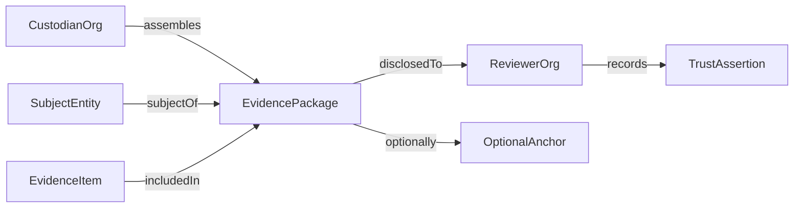
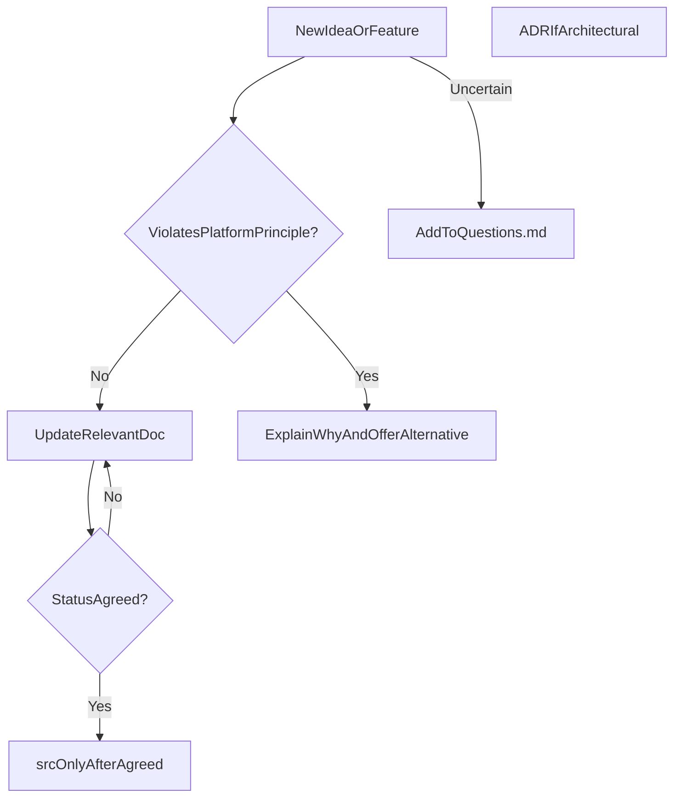

# TrustRegistry — Product Architecture Foundation

**Document ID:** DOC-FOUNDATION  
**Status:** Draft  
**Last updated:** 2026-06-28

This document records the initial product architecture review and foundation plan for TrustRegistry. It complements the governing documents in [governance/](../governance/) and should be checked against [PlatformPrinciples.md](../governance/PlatformPrinciples.md) as the product evolves.

**Related product:** [AuditorsVault](https://github.com/AuditorsVault/site) is a separate peer product (PostgreSQL database history). See [ADR-020](../governance/ArchitectureDecisionLog.md).

---

## Executive read

You are building **digital trust infrastructure**, not a blockchain product. The strongest parts of your vision are:

- **Trust assertions, not truth** — avoids the platform becoming an oracle; aligns with how regulators and auditors actually work.
- **Independent multi-party review** — same evidence package, different conclusions; this is a genuine differentiator vs. typical GRC tools that optimize for *one* org's compliance dashboard.
- **Blockchain as interchangeable publishing** — correct architectural instinct; immutability and provable history are the requirements; chain is one implementation option.

Your chosen v1 context (**regulated industry buyer**, **multi-tenant SaaS**, **web and mobile clients**) raises the bar on **tenant isolation, data residency, liability boundaries, export/portability, and API-first design**—these must appear in Platform Principles and Risks early, not as late Architecture surprises.

---

## Multi-channel provision (web and mobile)

TrustRegistry is a **multi-channel product**. Web and mobile are peer clients; the platform API is canonical (ADR-030).

**Provisioned now (documentation only):**

| Artifact | What was recorded |
|----------|-------------------|
| [ProductVision.md](../governance/ProductVision.md) | Multi-channel intent; persona channel hypotheses |
| [ADR-030](../governance/ArchitectureDecisionLog.md) | API-first, thin clients |
| [Questions.md](../governance/Questions.md) | Q-090–Q-093 (parity, journeys, offline, tech choice) |
| [Requirements.md](Requirements.md) | NFR-100 multi-client support |
| [Risks.md](../governance/Risks.md) | RISK-090 parity scope creep |

**Deferred until Phase 1:** client framework selection (Q-093), wireframes per channel, mobile-specific Security (push, secure storage, cert pinning).

**Working hypothesis:** Web-first MVP; mobile reviewer subset unless Q-090 resolves otherwise.

---

## Vision review and challenges

### What is strong

| Idea | Why it matters |
|------|----------------|
| Evidence + immutable history | Regulators and partners ask for *demonstrable* compliance, not self-attestation |
| Multiple independent reviewers | Mirrors real-world audit/regulatory review; supports dispute and appeal |
| Platform records, does not declare truth | Reduces legal exposure and avoids "TrustRegistry certified this" misread |
| Optional blockchain anchoring | Lets you sell integrity without selling crypto complexity |

### Assumptions to challenge now

**1. "Regulated industry" is still too broad for v1**

Regulated buyers differ sharply: financial services (AML/KYC), healthcare (HIPAA), energy, defense supply chain, etc. Each has different evidence types, retention rules, and review workflows.

**Recommendation:** In [ProductVision.md](../governance/ProductVision.md), name a **beachhead vertical** (even as a hypothesis), e.g. "financial services third-party risk" or "ISO/SOC-style assurance packages." Everything else stays in [Questions.md](../governance/Questions.md) until validated.

**2. Multi-tenant SaaS vs. "independent review of the same evidence package"**

These can conflict commercially and technically:

- Tenants will ask: *Who else sees our evidence?*
- Regulators may require: *Evidence stays in our jurisdiction / our control.*
- Independent review implies **controlled disclosure**—not "all tenants browse each other's vault."

**Recommendation:** Frame the product as **evidence package publishing with scoped disclosure**, not a shared datastore. Reviewers receive a **package reference + integrity proofs**, not blanket tenant access. Capture as **FP-030** (disclosure is explicit and revocable) and **ADR-010** (package export model).

**3. "Blockchain is not the product" — but immutability still is**

Buyers in regulated markets often want **WORM retention, tamper-evidence, and audit logs**—they may not care whether that is Merkle trees, object-lock storage, or chain anchoring.

**Recommendation:** In terminology, separate:

- **Integrity proof** (cryptographic, verifiable)
- **Anchoring** (optional external timestamp/commitment)
- **Publishing provider** (pluggable: none, public chain, private notary, etc.)

Do not let "no blockchain" become "no immutability story."

**4. Trust assertions without truth — clarify liability**

If Org A asserts "compliant" and Org B asserts "non-compliant" on the same package, the platform must not rank them—but **customers will still ask whose assertion matters**.

**Recommendation:** Principles should state: assertions are **attributed, timestamped, scoped, and non-exclusive**; the platform provides **provenance and disagreement visibility**, not arbitration (unless a future optional workflow is explicitly designed).

**5. Competitive positioning risk**

GRC/compliance SaaS is crowded (Vanta, Drata, OneTrust, Archer, etc.). Differentiation must be crisp:

> **TrustRegistry helps organisations produce portable, integrity-proven evidence packages that third parties can independently review and assert against—without the platform declaring outcomes.**

If v1 looks like "another compliance dashboard," you will lose on features; win on **inter-org trust mechanics** or don't build yet.

**6. Product naming and scope**

TrustRegistry names the **registry of trust assertions**—not a vault owned by auditors alone. In regulated-industry v1, **compliance owners and evidence custodians** may be buyers; **auditors/regulators/partners** are reviewers. Define **personas explicitly** in Vision/Problem Statement.

---

## Suggested vision refinement (draft direction)

**One-line vision (candidate):**

> TrustRegistry enables regulated organisations to assemble, preserve, and selectively disclose integrity-proven evidence packages—so regulators, auditors, and partners can independently review the same material and record their own trust assertions, without the platform declaring truth.

**Non-goals for v1 (candidate):**

- Not a regulator-of-record
- Not a single score/rating agency
- Not a mandatory blockchain network
- Not a full GRC replacement (integrations may come later)
- Not a PostgreSQL audit tool (that is [AuditorsVault](https://github.com/AuditorsVault/site)—ADR-020)

---

## Repository structure — phased, not exhaustive

Create the **skeleton** now; **populate documents as the sequence demands**.

```text
TrustRegistry/
├── README.md                 # Pointer to governance + how to read docs
├── governance/
│   ├── PlatformPrinciples.md # Constitutional (FP-xxx)
│   ├── ProductVision.md      # Vision + beachhead + non-goals
│   ├── Terminology.md        # Ubiquitous language (start minimal)
│   ├── ArchitectureDecisionLog.md
│   ├── Questions.md          # Q-xxx — assumptions we refuse to make
│   └── Risks.md              # RISK-xxx — commercial/legal/technical
├── docs/
│   ├── TrustRegistryFoundation.md  # This document
│   ├── ProblemStatement.md   # PS-xxx pain, stakes, why now
│   ├── DomainModel.md        # Concepts + relationships (no tables yet)
│   ├── Requirements.md       # FR-xxx / NFR-xxx (later wave)
│   ├── Architecture.md       # Later
│   ├── Security.md           # Later
│   ├── API.md                # Later
│   └── Roadmap.md            # Phases, not dates unless committed
├── ui/                       # Empty until Requirements stable
└── src/                      # Empty placeholder; README: "no code until agreed design"
```

### Defer initially (create when triggered)

| Document | Create when |
|----------|-------------|
| [EntityModel.md](EntityModel.md), [EvidenceModel.md](EvidenceModel.md), [TrustModel.md](TrustModel.md), [ApprovalModel.md](ApprovalModel.md) | DomainModel.md splits because concepts are stable enough |
| [UserJourneys.md](../ui/UserJourneys.md), [Wireframes.md](../ui/Wireframes.md), [DesignSystem.md](../ui/DesignSystem.md) | Problem + core requirements exist |
| [Architecture.md](Architecture.md), [Security.md](Security.md), [API.md](API.md) | Domain model + NFRs + key ADRs exist |

### Numbering convention (apply from day one)

- **FP-010, FP-020…** — Platform Principles (constitutional)
- **PS-010…** — Problem statement themes
- **DM-010…** — Domain model elements (when split)
- **FR-010 / NFR-010** — Requirements
- **ADR-010** — Architecture decisions
- **Q-010** — Open questions
- **RISK-010** — Risks

Every doc gets a **Document ID** header and **Status**: `Draft | Review | Agreed`.

---

## First documents — order and purpose

Follow the mandated sequence, but **merge lightweight artifacts** where it reduces thrash.

### Wave 0 — Bootstrap (Day 0)

1. **Repository + [README.md](../README.md)** — documentation-first contract, numbering rules, link to governance.
2. **[governance/Questions.md](../governance/Questions.md)** — seed immediately; never guess silently.
3. **[governance/Risks.md](../governance/Risks.md)** — seed with top risks from this review.

### Wave 1 — Constitution (must be Agreed before domain work)

4. **[governance/PlatformPrinciples.md](../governance/PlatformPrinciples.md)** — **the constitutional document** ("First Principles"). Suggested starter set to debate:

| ID | Principle (draft) |
|----|-------------------|
| FP-010 | The platform records trust assertions; it does not declare truth |
| FP-020 | Evidence integrity is provable without requiring blockchain |
| FP-030 | Disclosure is explicit, scoped, attributable, and revocable |
| FP-040 | Multiple organisations may review the same evidence package independently |
| FP-050 | Assertions are attributed to reviewers, not to the platform |
| FP-060 | Immutable history is preserved; corrections are additive, not silent edits |
| FP-070 | Tenant data isolation is non-negotiable in multi-tenant SaaS |
| FP-080 | Export and portability beat vendor lock-in |
| FP-090 | Simplicity over speculative features; prove value before expanding scope |

5. **[governance/ProductVision.md](../governance/ProductVision.md)** — vision, beachhead hypothesis, personas, non-goals, success signals (not metrics theater).

6. **[governance/Terminology.md](../governance/Terminology.md)** — **minimal** glossary only: Entity, Evidence, Evidence Package, Trust Assertion, Reviewer, Custodian, Anchoring, Publishing Provider. Expand as Domain Model solidifies.

### Wave 2 — Problem and domain (Agree before Requirements)

7. **[docs/ProblemStatement.md](ProblemStatement.md)** — regulated buyer pain: audit fatigue, inconsistent evidence, disputed conclusions, retention, cross-border review. Tie each pain to a principle.

8. **[docs/DomainModel.md](DomainModel.md)** — conceptual model only (diagrams + definitions). Expected core concepts:



**Challenge for Domain Model workshop:** Define **Entity** narrowly for v1 (legal entity? control? supplier?)—this is the highest-leverage modeling decision.

### Wave 3 — First ADR (before Requirements detail)

9. **[governance/ArchitectureDecisionLog.md](../governance/ArchitectureDecisionLog.md)** with **ADR-010: Evidence package as the unit of disclosure and review** — commits to portable packages + integrity proofs + scoped sharing as the core boundary object (not "shared tenant views").

### Wave 4 — Requirements (only after Waves 1–3 Agreed)

10. **[docs/Requirements.md](Requirements.md)** — start with **NFRs for regulated SaaS** (tenant isolation, retention, audit logging, residency, export) before feature FRs.

11. **[docs/Roadmap.md](Roadmap.md)** — phased outcomes (Documentation MVP → Design MVP → Implementation MVP), not a feature laundry list.

---

## Seed entries for Questions and Risks (do not assume)

### [Questions.md](../governance/Questions.md) — initial Q-010 block

- **Q-010:** Which regulated beachhead vertical for v1 (FS, health, energy, etc.)?
- **Q-020:** What is the minimum **Entity** definition for v1?
- **Q-030:** Is cross-tenant review always via **exported packages**, or also via in-platform reviewer accounts?
- **Q-040:** Required data residency regions at launch?
- **Q-050:** Retention defaults vs. customer policy vs. regulatory minimums—who wins?
- **Q-060:** What assertion types are in scope (pass/fail, qualified, risk rating, free text)?
- **Q-070:** Integration strategy: replace GRC vs. complement via exports/API?
- **Q-090:** Web and mobile: full parity or role-based channel scope?
- **Q-091:** Which v1 journeys must work on mobile?
- **Q-092:** Is offline mobile required for reviewers?
- **Q-093:** Native apps vs responsive web vs hybrid—when to decide?

### [Risks.md](../governance/Risks.md) — initial RISK-010 block

- **RISK-010 Commercial:** Perceived as "yet another GRC tool" without inter-org review differentiation
- **RISK-020 Legal:** Misinterpretation of platform as certifying truth or regulatory approval
- **RISK-030 Legal/Privacy:** Evidence packages contain PII/secrets; disclosure scope errors
- **RISK-040 Technical:** Multi-tenant isolation failure = existential trust loss
- **RISK-050 Regulatory:** Data residency / cross-border transfer constraints limit SaaS model
- **RISK-060 Product:** Scope explosion across regulations before beachhead validation
- **RISK-070 Technical:** Immutability vs. GDPR rectification/erasure tension (additive corrections model must be designed early)
- **RISK-090 Product:** Multi-channel feature parity scope creep before beachhead validation

---

## How we work together (operating model)



**When you ask to skip ahead:** Map the skip to missing prerequisites (e.g., API before Domain Model → unbounded endpoints; UI before Problem Statement → pretty screens for the wrong job).

---

## Foundation status

| Wave | Status |
|------|--------|
| Wave 0 — Bootstrap | Complete |
| Wave 1 — Constitution | Draft — awaiting **Agreed** |
| Wave 2 — Problem and domain | Draft — awaiting **Agreed** |
| Wave 3 — ADR-010 | Accepted |
| Wave 3 — ADR-020 (AuditorsVault separation) | Accepted |
| Wave 3 — ADR-030 (multi-client architecture) | Accepted |
| Wave 3 — ADR-040 (entity type metamodel) | Accepted |
| Wave 4 — Requirements | Draft (includes NFR-100, NFR-110) |
| Entity model split | [EntityModel.md](EntityModel.md) Draft |

No [src/](../src/) code, no API specs, no wireframes until Problem + Domain Model reach **Agreed**.
